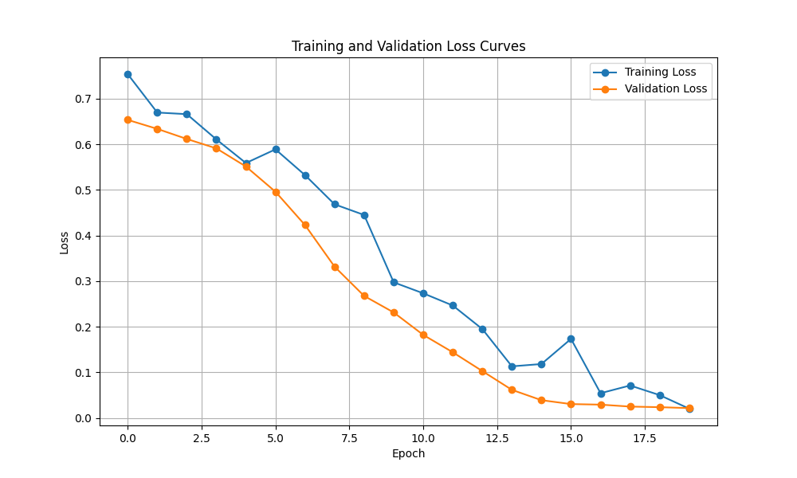
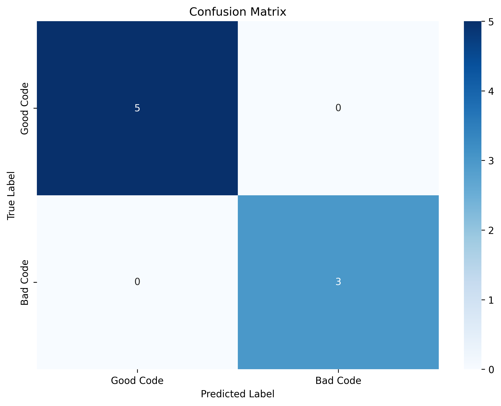

# Code Review Classifier

A machine learning model that classifies code snippets as either good or bad based on various code quality metrics and patterns. The model uses CodeBERT, a pre-trained transformer model specifically designed for code understanding, to analyze and classify code snippets.

## Features

- Classifies code snippets as good or bad based on code quality
- Handles various code patterns including:
  - Safe vs unsafe file handling
  - Proper vs improper error handling
  - Safe vs unsafe string formatting
  - Complete vs incomplete code
  - Proper vs improper function definitions
  - Safe vs unsafe data validation
- Provides detailed evaluation metrics and visualizations

## Requirements

- Python 3.8+
- PyTorch
- Transformers
- Pandas
- NumPy
- Matplotlib
- Seaborn
- Scikit-learn

Install dependencies using:
```bash
pip install -r requirements.txt
```

## Project Structure

```
.
├── train.py              # Training script
├── predict.py            # Prediction script
├── requirements.txt      # Project dependencies
├── code_review_dataset.csv  # Training dataset
├── confusion_matrix.png  # Model evaluation visualization
├── loss_curves.png      # Training progress visualization
└── codebert_review_model_balanced.pt  # Trained model
```

## Usage

### 1. Train the Model

Train the model using the provided dataset:
```bash
python train.py
```

The training process will:
- Load and preprocess the dataset
- Train the CodeBERT-based classifier
- Generate loss curves and evaluation metrics
- Save the trained model

### 2. Make Predictions

Use the trained model to classify new code snippets:
```bash
python predict.py
```

## Model Architecture

The model uses a CodeBERT-based architecture:
1. CodeBERT encoder for code understanding
2. Dropout layer for regularization
3. Linear classifier for binary classification

## Training Process

The training process includes:
- Data augmentation for robust learning
- Balanced sampling to handle class imbalance
- Early stopping to prevent overfitting
- Validation metrics tracking
- Loss visualization

## Evaluation Metrics

The model provides:
- Accuracy
- Precision
- Recall
- F1 Score
- Confusion Matrix
- Training/Validation Loss Curves

### Training Progress


### Model Performance


## Example Results

```
🔍 Evaluation Results:
Accuracy:  1.0000
Precision: 1.0000
Recall:    1.0000
F1 Score:  1.0000
Confusion Matrix:
[[5 0]
 [0 3]]
```

## Code Examples

### Good Code Patterns
```python
# Safe file handling
with open('file.txt', 'r') as f:
    content = f.read()
    print(content)

# Proper error handling
try:
    result = x / y
except ZeroDivisionError:
    print('Cannot divide by zero')
else:
    print(f'Result: {result}')

# Safe string formatting
name = 'John'
print(f'Hello {name}')
```

### Bad Code Patterns
```python
# Incomplete code
def add(a, b):
    return

# Unsafe file handling
f = open('file.txt')
content = f.read()
f.close()

# No error handling
result = x / y
print(f'Result: {result}')
```

## Contributing

Contributions are welcome! Please feel free to submit a Pull Request.

## License

This project is licensed under the MIT License - see the LICENSE file for details.

## Acknowledgments

- CodeBERT: Pre-trained model for code understanding
- PyTorch: Deep learning framework
- Transformers: Hugging Face's transformer library 